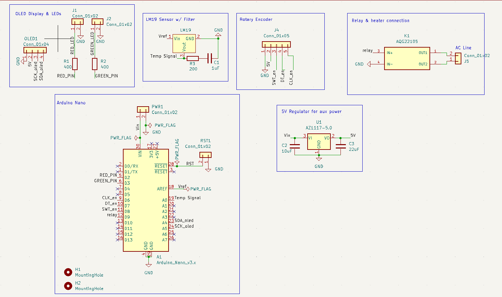

# Temperature PID Controller using an Arduino

This project uses a PID controller algorithm to heat up a heating cartridge and maintain an accurate temperature using an Arduino nano.
  

 

## Schematic

 

## Parts List

See `Parts_list.csv`

## Controls

1. Single-press to reset set temperature.
2. Double-press increase increment step for changing set temperature.
3. Press & hold to start up heating process.
